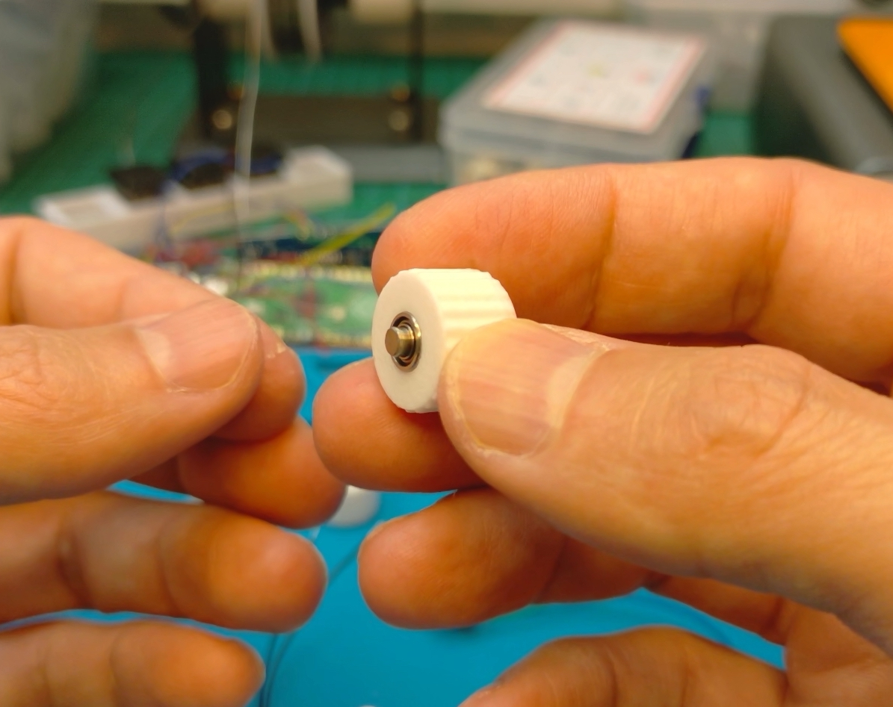
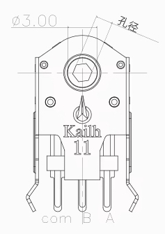

# **MEH01 replacement encoder for EVQWGD001**
 This is a very low cost (~ 1USD) full replacement for EVQWGD001 horizontal encoder. Project comes with all STL/STEP files for printing and incorporation into projects. It has the same base size as EVQWGD001 but due to different mounting mechanisms it won't "lock" into the EWQ* socket even though it fits. There are special openings in MEH01 socket where the encoder can "clip-in". 

Two versions are provided. With and without switch.

## **KiCAD** symbol, footprint and 3D model is also available (untested), check my [KiCad Library](https://github.com/EverydayErgo/KiCAD)

||||||
|--|--|--|--|--|
||
||||||

|BOM|||
|--|--|--|
|**Item**|**Dimensions**|**Count**|
|[Kailh mouse encoder](img/kailh_1.png)|5mm|1|
|[MR63 RC Bearings (used in RC cars etc)](img/bearings_zzr.jpeg)|(M3)3mm x 6mm x 2mm|1|
|[Metal pin (bearing dowel)](img/metal_pin_1.jpg)|(M3)3mm x 6mm|1|
|[Tactile Push button](img/switch_1.jpg)|3mm x 4mm x 2mm|1|
|[AWG 30 Wire (best multi color)](img/wire_awg_30_1.jpg)||1|

Notice that the tactile switch has 1 leg, there's also version with 2 legs, this might be harder to solder wire to.

|STL||
|--|--|
|Item|Description|
|[Housing (switch)](stl/encoder_switch.stl)|Housing for the encoder with tactile switch|
|[Housing (no switch)](stl/encoder_no_switch.stl)|Housing for the encoder without switch|
|[Roller](stl/roller.stl)|Roller wheel|

**Print with PETG with 0.4mm nozzle. For the roller use support.**

|STEP||
|--|--|
|Item|Description|
|[Housing (switch)](step/encoder_switch.stp)|Housing for the encoder with tactile switch|
|[Housing (no switch)](step/encoder_no_switch.stp)|Housing for the encoder without switch|
|[Roller](step/roller.stp)|Roller wheel|
|[MEH01](step/MEH01.stp)|Full assembly|
|[Socket PCB](step/socket_pcb.stp)|Socket/mount for PCB|
|[Socket](step/socket.stp)|Socket/mount for keyboard plate|

Use these files to incorporate MEH01 into your CAD project.

## How to assemble
There are few live streams where I am building MEH01:
- [[Let's build #42] - Chordie, chording split mechanical keyboard you shouldn't be scared of
](https://youtu.be/GDPil8_5gyE?t=2537)
- [[Let's build #45] - Chordie, chording split mechanical keyboard you shouldn't be scared of
](https://youtu.be/FPBJ9f71gYo?t=291)

|||||
|--|--|--|--|
||
|||||

For the version with tactile switch, solder AWG 30 wire to the switch terminals and route it. There's a canal under the switch to route left terminal, both should go via two holes on the side of the housing.

Push the bearing and metal pin inside the roller.

Clip side mounting legs from the Kailh mouse encoder.

Solder wires to Kailh encoder terminals. Route them through the holes on the bottom of the housing. Back (black part) of the encoder should be facing the roller. Attach the roller. Take notice of encoder terminals, Com/A/B pins are in different positions as compared EVQWGD001, check the schematic below. Slide the encoder into the housing, you might want to start at 45 deg angle and then make you way. Check the stream if unshure on how to slide it in. 

|||||
|--|--|--|--|
||
|||||

There's a tiny clip inside the socket that should hold the housing quite well.